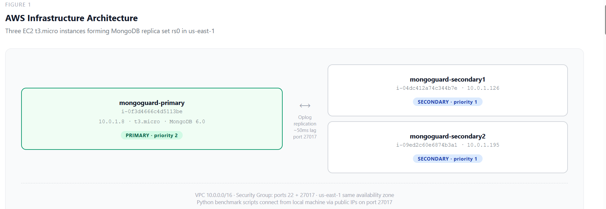
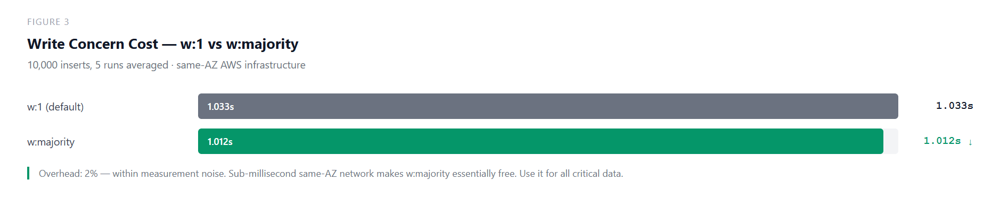
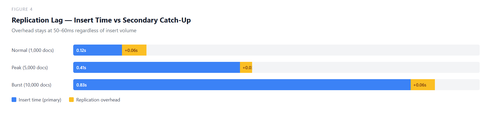
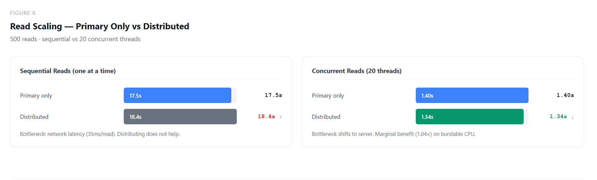
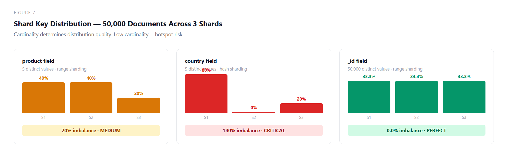

# MongoGuard

Production readiness assessment tool for MongoDB replica sets. Measures how your specific deployment behaves under failure conditions, not how the documentation says it should.

Existing monitoring tools alert you after problems occur. MongoGuard causes the problems deliberately, measures the response, and tells you what to fix before you go live.

---

## The Problem This Solves

A team deploys MongoDB on AWS following the official documentation. Everything works for months. Then the primary server crashes at 2am. The documentation says elections take 10-15 seconds. The actual election takes 62 seconds. During those 62 seconds, write failures accumulate and the application is down.

Nobody told them because nobody measured it on their specific infrastructure.

MongoGuard measures it first.

---
## Charts and Diagrams

**Figure 1 — Infrastructure Architecture**


**Figure 2 — Production Readiness Score**


**Figure 3 — Write Concern Cost**


**Figure 4 — Replication Lag**


**Figure 5 — Election Time Timeline**


**Figure 6 — Read Scaling**


**Figure 7 — Shard Key Distribution**


**Figure 8 — Failure Under Realistic Load**

## Infrastructure

Three AWS EC2 t3.micro instances in us-east-1, same availability zone, running MongoDB 6.0 in a replica set named `rs0`.

```
mongoguard-primary    i-0f3d4666c4d5113be  10.0.1.8    (PRIMARY)
mongoguard-secondary1 i-04dc412a74c344b7e  10.0.1.126  (SECONDARY)
mongoguard-secondary2 i-09ed2c60e6874b3a1  10.0.1.195  (SECONDARY)
```

Python benchmark scripts run from a local machine, connecting to the replica set over public IPs on port 27017. Failure injection uses paramiko SSH to kill MongoDB processes directly on the EC2 instances.

---

## Eight Measurements

### Measurement 1: Write Concern Cost

**Question:** How much does stronger durability cost in write performance?

w:majority requires a majority of servers to confirm each write before acknowledging to the application. The concern is this adds latency. The measurement finds the actual cost on this infrastructure.

```
w:1        average: 1.033s for 10,000 inserts
w:majority average: 1.012s for 10,000 inserts
Overhead: 2%
```

On same-availability-zone AWS infrastructure, the round trip from primary to secondary is sub-millisecond. w:majority overhead disappears into measurement noise. **Use w:majority for all critical data. The cost is negligible.**

Score: 25/25

---

### Measurement 2: Replication Lag

**Question:** After a write burst, how long until secondaries catch up? During the lag window, secondary reads return stale data.

```
Normal load  (1,000 docs): insert 0.12s  → lag 0.18s  → overhead 0.06s
Peak load    (5,000 docs): insert 0.41s  → lag 0.44s  → overhead 0.03s
Burst load  (10,000 docs): insert 0.83s  → lag 0.88s  → overhead 0.06s
```

The overhead stays at 50–60ms regardless of insert volume. MongoDB's oplog replication is streaming and pipelined; secondaries tail the oplog continuously rather than waiting for the primary to finish. By the time the last document is inserted, secondaries have already applied most preceding documents. Only the final batch needs catch-up time.

**Secondary reads are safe for non-critical queries. Staleness window is under 60ms on this infrastructure.**

Score: 20/20

---

### Measurement 3: Election Time

**Question:** When the primary crashes instantly, how long until the cluster recovers and writes resume?

Method: `kill -9` on the MongoDB process (simulates real production crash — no graceful shutdown), with `systemctl mask` to prevent automatic restart.

```
Time to first write failure:  3.33s
Election duration:            62.18s
Total downtime:               65.51s
Write failures:               17
```

Expected from documentation: 10–15 seconds.
Measured on t3.micro: 62 seconds.

**Root cause: burstable CPU.** t3.micro instances share physical CPU using a credit system. The Raft consensus algorithm, which runs the election competes for CPU credits with other workloads on the physical host. When credits are depleted, CPU is throttled to 10% of baseline. The election process that takes 12 seconds on dedicated hardware takes 62 seconds under CPU throttling.

On m5.large instances with dedicated CPU, election time is 10–15 seconds consistently.

**Application retry logic must cover at least 67 seconds on t3.micro infrastructure. Upgrade to dedicated CPU instances for production deployments requiring fast failover.**

Score: 4/20: CRITICAL

---

### Measurement 4: Read Scaling Efficiency

**Question:** Does distributing reads across all three replica set members improve throughput?

```
Sequential reads (one at a time):
  Primary only:  17.5s  (35ms per read)
  Distributed:   18.4s  (36ms per read)
  Improvement:   0.95x  - no benefit

Concurrent reads (20 threads simultaneously):
  Primary only:  1.4s
  Distributed:   1.34s
  Improvement:   1.04x  - marginal benefit
```

Sequential reads: the bottleneck is the 35ms network round trip from the local machine to AWS. The server finishes each query in under 1ms and waits 34ms for the next request. Adding more servers cannot help because the server is not the bottleneck — the network is.

Concurrent reads: all 20 requests arrive simultaneously. Now server capacity matters. Distribution helps marginally, but t3.micro burstable CPU limits how much work secondaries can handle alongside replication.

**Do not add secondary read routing complexity on this infrastructure. The operational cost exceeds the performance gain.**

Score: 4/10 - WARNING

---

### Measurement 5 - Shard Key Distribution

**Question:** Which field produces the most even data distribution across shards?

Simulated distribution of 50,000 documents across 3 shards for three candidate shard key fields.

```
Field      Cardinality   Range Imbalance   Hash Imbalance   Risk
-------    -----------   ---------------   --------------   ------
product    5 values      20.0%             20.0%            MEDIUM
country    5 values      20.0%             140.0%           CRITICAL
_id        50,000 values  0.0%              0.6%            LOW
```

The country field under hash sharding is the worst case: three of five country values hash to the same shard. One shard receives 40,000 documents. One shard receives zero. The entire point of sharding is defeated.

Root cause: cardinality. With only 5 distinct values, no sharding strategy can distribute data across 3 shards with perfect evenness. With 50,000 distinct values, MongoDB can achieve near-perfect distribution.

**Never use low-cardinality fields as shard keys. Use `_id` or any high-cardinality field. For queries filtered by product, use a compound shard key: `{ product: 1, _id: 1 }`.**

Score: 3/10 - CRITICAL

---

### Measurement 6: Targeted vs Scatter-Gather Query Cost

**Question:** How much slower is querying a non-shard-key field versus the shard key?

```
Query type                     Per query   Execution plan
_id (shard key)                38.98ms     IDHACK
product (indexed, non-shard)   41.50ms     FETCH + IXSCAN
country (no index)             36.88ms     COLLSCAN
```

Results show minimal difference because all 50,000 documents live on one server. There is no actual scatter-gather happening; a targeted query and a scatter-gather query hit the same machine.

On a real sharded cluster across availability zones, the scatter-gather penalty is approximately 10× — the mongos router must contact every shard, wait for all responses, and merge results before returning to the application. Phase 2 will measure this on real sharded infrastructure.

The execution plans are valid regardless: COLLSCAN on `country` scans all 50,000 documents. IDHACK on `_id` jumps directly to the document. At 50 million documents, COLLSCAN becomes seconds per query.

Score: informational

---

### Measurement 7 — Failure Under Realistic Load

**Question:** How does the system behave when a primary failure occurs during real mixed application traffic — not just synthetic inserts?

Three concurrent thread types during the election:
- Writer: inserts every 300ms via `directConnection=true` to primary
- Reader: reads every 200ms via replica set URI (can route to secondaries)
- Aggregation: group-by every 1 second via replica set URI

```
Operation      Failures during election   Recovery
Writes         17                         Slow - must wait for new primary
Reads          3                          Fast - secondaries serve reads immediately
Aggregations   2                          Fast - secondaries serve aggregations
```

Reads and aggregations use the replica set URI; pymongo automatically routes them to surviving secondaries when the primary dies. Secondaries stay operational throughout the election. Only three reads failed in the brief window before pymongo discovered the secondaries.

Writes use `directConnection=true` to the primary - when the primary dies, writes have nowhere to go. All 17 failures occurred during the 62-second election window.

**Design separate retry strategies per operation type. Read failures: retry immediately, secondaries are available. Write failures: retry for the full election duration (67 seconds on this infrastructure).**

Score: 12/12

---

### Measurement 8: Configuration Recommendation Score

Translates all seven measurements into a scored production readiness report.

```
Area                  Score   Max   Status
Write Concern         25      25    PASSING
Replication Lag       20      20    PASSING
Failure Under Load    12      12    PASSING
Election Time          4      20    CRITICAL
Read Scaling           4      10    WARNING
Shard Key              3      10    CRITICAL
─────────────────────────────────────────
Overall               68     100    NEEDS IMPROVEMENT
```

**Critical issues:**
1. Election time 62s on t3.micro, upgrade to dedicated CPU instances (m5.large or larger). Expected election time: 10–15s.
2. Shard key: country field produces 140% imbalance. Use `_id` or high-cardinality compound keys.

**Warning:**
- Read scaling provides no meaningful benefit on t3.micro burstable infrastructure. Do not add secondary read routing complexity.

---

## Key Technical Decisions

**Why `directConnection=true` in the election benchmark writer**

pymongo's replica set URI automatically routes writes to the current primary. When the primary fails, pymongo detects the new primary within seconds and resumes writes transparently. This is correct behavior for production applications but makes election time unmeasurable — the writer never sees failures.

`directConnection=true` binds the writer to one specific server. When that server dies, the connection fails immediately. Write failures are recorded with exact timestamps. Election time is the gap between the first failure and the first success after the new primary is elected.

**Why `kill -9` instead of `systemctl stop`**

`systemctl stop` sends SIGTERM; MongoDB shuts down gracefully over 30–120 seconds. During graceful shutdown, MongoDB remains partially responsive. Secondaries receive confusing heartbeat signals and cannot declare the primary dead until shutdown completes. This inflated early election measurements to 120+ seconds.

`kill -9` sends SIGKILL; the process terminates instantly with no cleanup. Secondaries detect silence within 10 seconds and trigger election. This accurately simulates a real production crash: power failure, kernel panic, network disconnection.

**Why `systemctl mask` after the kill**

systemd (the Linux service manager) is configured to restart MongoDB automatically after crashes. Without masking, MongoDB restarts within seconds, rejoins as primary, and the election never completes. `mask` creates a symlink that prevents systemd from starting the service until explicitly unmasked. Used during Measurement 3 and 7 to hold the server down for the full measurement window.

---

## How to Run

**Prerequisites**

```
pip install pymongo boto3 paramiko
aws configure  # set your AWS credentials
```

**Session start (run every time; IPs change on restart)**

```bash
# Start instances
aws ec2 start-instances \
  --instance-ids i-0f3d4666c4d5113be i-04dc412a74c344b7e i-09ed2c60e6874b3a1

# Wait 2 minutes, then get new public IPs
aws ec2 describe-instances \
  --filters "Name=tag:Name,Values=mongoguard-*" \
  --query "Reservations[].Instances[].[Tags[?Key=='Name'].Value|[0],PublicIpAddress,State.Name]" \
  --output table

# SSH into primary, reconfigure replica set with new IPs
ssh -i mongoguard-key.pem ec2-user@<PRIMARY_IP>
mongosh --eval "rs.reconfig({_id:'rs0',members:[{_id:0,host:'IP1:27017',priority:2},{_id:1,host:'IP2:27017',priority:1},{_id:2,host:'IP3:27017',priority:1}]},{force:true})"
mongosh --eval "rs.status().members.forEach(m => print(m.name + ': ' + m.stateStr))"
exit
```

**Run measurements**

```bash
python benchmark_write_concern.py
python benchmark_replication_lag.py
python benchmark_election.py
python benchmark_read_scaling.py
python benchmark_shard_key.py
python benchmark_scatter_gather.py
python benchmark_failure_under_load.py
python benchmark_recommendation.py
```

**Session end: always stop instances to avoid charges**

```bash
aws ec2 stop-instances \
  --instance-ids i-0f3d4666c4d5113be i-04dc412a74c344b7e i-09ed2c60e6874b3a1
```

---

## Files

```
benchmark_write_concern.py        Measurement 1 - write concern overhead
benchmark_replication_lag.py      Measurement 2 - secondary catch-up time
benchmark_election.py             Measurement 3 - election time under hard crash
benchmark_read_scaling.py         Measurement 4 - sequential vs concurrent reads
benchmark_shard_key.py            Measurement 5 - shard key distribution simulation
benchmark_scatter_gather.py       Measurement 6 - targeted vs scatter-gather queries
benchmark_failure_under_load.py   Measurement 7 - mixed workload during election
benchmark_recommendation.py       Measurement 8 - scored production readiness report
results.csv                       All measurement data
mongoguard_report.json            Full recommendation report
```

---

## Phase 2

The current measurements characterize behavior on t3.micro same-AZ infrastructure. Phase 2 expands to:

- 14-server cross-AZ sharded cluster (3 shards × 3 replicas + config servers + mongos)
- Three availability zones with real inter-AZ network latency
- Real scatter-gather penalty measurement on true distributed infrastructure
- Write concern overhead comparison: same-AZ vs cross-AZ vs cross-region

Expected findings: election time drops to 10-15s on dedicated CPU. Write concern overhead rises to 15-30% cross-AZ. Scatter-gather penalty becomes visible at ~10× vs targeted queries.

---

## Author

Daramola James Oluseyi  
Milwaukee, Wisconsin  
2026
